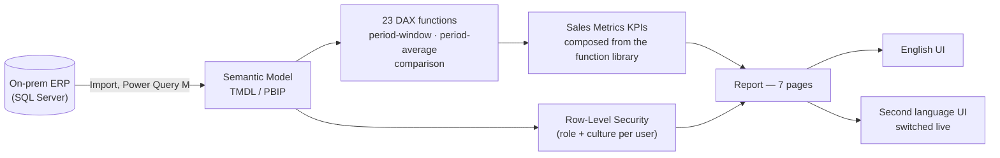

# Sales Analytics

A **Power BI** sales-monitoring solution built for a multi-brand FMCG/consumer-goods
distribution business — daily and monthly sales performance across time, brand,
product, customer, store, and sales-rep dimensions.

This repository documents the architecture and DAX behind the solution's **Sales
Metrics** module. It's a portfolio write-up, not the live report: all entity names in
the underlying model are generic sample labels (`Client 001`, `Store 001`, `Product
001`, `Brand 1`…), and no real business figures, screenshots, or connection details
are included here.

## Business context

The business distributes ~10 brands across roughly 4 divisions through three sales
channels — Modern Trade, Traditional Trade, and E-commerce — via a network of stores
grouped into regional delivery routes, each served by a sales rep, an area manager,
and (where applicable) a field merchandiser. This module is the sales team's daily
pulse check: how is this month tracking against plan and last year, which brands and
products are driving or dragging performance, which customers need attention, and
how is each rep's territory doing.

## What this covers

- **Daily & historical sales monitoring** — value, volume, margin, invoice count, and
  numeric distribution, sliced by month, week, brand, product, customer, store, and
  sales rep. It provides day-by-day and full-year historical monitoring, not just a
  monthly snapshot — a manager can drill into exactly which day drove a swing, or
  step back and track a multi-month trend, from the same KPI set.
- **A monthly pulse check with day-level drill-down** — current-month value, margin,
  invoice count, and products-per-invoice, each benchmarked against prior year and
  the weekly plan pace, backed by a daily breakdown table for tracing exactly which
  day drove a swing before it shows up in month-end numbers.
- **A full-year trend view** — the same KPI set plotted across every month instead of
  one, for catching a slow multi-month slide rather than reacting to one bad week.
- **Brand & product performance** — sales, margin, and plan attainment broken out by
  brand and product, with a top-clients ranking and a sales-share view side by side.
- **Product-level sales analysis** — value and quantity pivots with sales share, YoY
  growth index, net average selling price comparison, and a top-customers-per-product
  ranking.
- **Customer & store performance** — plan-vs-actual tracked by customer and by store,
  a weekly payments-received trend, and sales share by channel — sales performance
  and receivables health seen together, not in separate reports.
- **Sales rep & territory performance** — rep-level plan attainment, returns, and
  distribution KPIs, with a geographic map of sales by route/city for spotting an
  under-serving store without a separate report per territory.
- **Plan vs. actual tracking** — a sales plan derived automatically from each brand's
  growth target, tracked to achievement rate and variance.
- **Rankings & sales share** — top customers, top products, and share-of-total views
  by brand and by channel.
- **A reusable DAX time-intelligence engine** — 23 purpose-built functions that every
  KPI composes, instead of one-off measures per comparison.
- **A fully dynamic, multi-language UI** — every label in the report resolves live
  from one culture measure; English is the default, with a second language (Albanian)
  supported as a live, switchable culture — no duplicated pages.

## Architecture

## Tech stack

- **Power BI** — authored in [PBIP](https://learn.microsoft.com/power-bi/developer/projects/projects-overview) (TMDL) format for source control
- **DAX user-defined functions** — a 23-function reusable time-intelligence and comparison library (see [DAX Function Library](docs/dax-functions.md))
- **DAX measures** — Sales Metrics KPIs composed from that library (see [DAX Measure Catalog](docs/dax-measures.md))
- **Power Query (M)** — SQL Server import and shaping
- **Row-Level Security** — role- and culture-based, resolved from a single access-control table
- **Dynamic localization** — a live culture toggle driving every label in the report from one measure

## Documentation

| Doc | Contents |
|---|---|
| [Data Model](docs/data-model.md) | Star schema, ER diagram, table catalog, relationships, calculation groups, RLS, and the dynamic localization architecture |
| [DAX Function Library](docs/dax-functions.md) | All 23 reusable functions — period-window, period-average/extreme, and comparison families — with full DAX bodies |
| [DAX Measure Catalog](docs/dax-measures.md) | Sales, plan, margin, invoicing/distribution, payments, and ranking measures, built on the function library |
| [Report Tour](docs/report-pages.md) | Page-by-page walkthrough of all 7 Sales Metrics pages |

## Highlights worth a closer look

- **A function library, not copy-paste DAX.** 23 DAX user-defined functions —
  period-window (`YearToDate`, `PriorYear`, `Trailing12Months`, …), period-average
  (`WeeklyAverage`, `MonthlyAverage`, …), and comparison (`GrowthIndex`,
  `AchievementRatio`, `ValueDifference`, …) — mean every KPI gets a full
  current/prior/YTD/weekly-average/growth-index family for free. Adding a new metric
  is composition, not new date logic.
- **Guarded comparison logic.** The comparison functions share consistent blank /
  future-date / past-date / negative-base handling, so a KPI card never shows a
  misleading "+100%" for a product that didn't exist yet or a blank for one that sold
  out.
- **Zero-duplication dynamic UI.** One `[User Culture]` measure, resolved from
  row-level security, drives every page title, KPI label, and filter caption through
  a single label dictionary — a genuinely live language switch, not two copies of
  the report.

## License

[MIT](LICENSE) — this repository (documentation, DAX/architecture write-ups) may be
reused freely with attribution. It does not include the underlying `.pbix`/PBIP
project files, which remain private.

## Author

**Fuad Gashi** — Power BI / Business Intelligence developer.
[GitHub](https://github.com/fuadgashi)
