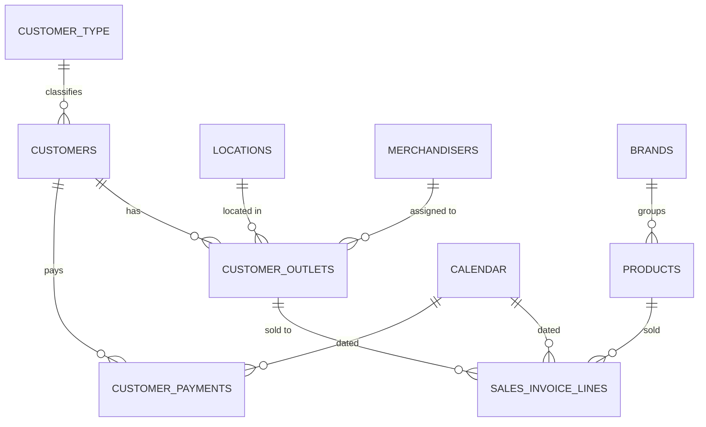

# Data Model

The semantic model follows a star schema: one core sales fact table plus a customer
payments fact, hung off shared customer, product, brand, calendar, and location
dimensions. Source data is imported from an on-premises ERP database via Power
Query; entity names (customers, stores, products) are generic sample labels — this
repository documents structure and logic, not real business data.

## Entity-relationship diagram



## Table catalog

### Dimensions

| Table | Purpose |
|---|---|
| **Calendar** | Date dimension spanning last year through this year. Hidden hierarchy (Quarter → Month → Week → Date) plus working-day helper measures (days elapsed/remaining this year, current week/month) that back the [function library](dax-functions.md)'s period-window logic. |
| **Products** | Product/article master. |
| **Brands** | Brand master (10 brands across 4 divisions). Carries each brand's commercial growth target (plan index), used by the sales-planning measures referenced from this solution's pages. |
| **Customers** | Customer master. Power Query derives **sales channel** (Modern Trade / Traditional Trade / E-commerce) and a **Key Account tier** from ERP classification codes, plus payment terms and account balance/currency. |
| **Customer Outlets** | Individual outlet/branch under each customer. Derives sales channel, merchandiser assignment, and regional sales-rep / area-manager codes from location + channel combinations. |
| **Customer Type** | Lookup restricting the sales fact to genuine sell-through customers (excludes internal/non-sales subject types). |
| **Locations** | City/location master, grouped into 4 named delivery routes/territories used on the Sales Representative page's map visual. |
| **Merchandisers** | Field merchandiser roster, linked from Customer Outlets. |

### Facts

| Table | Purpose |
|---|---|
| **Sales Invoice Lines** | **The core sales fact table.** One row per invoice line: quantity, list price, discount %, extra discount %, average cost, VAT, and a returns flag. Gross/net unit price and VAT-inclusive cost are computed in Power Query. Every measure in this solution is built on this table. |
| **Customer Payments** | Customer ledger extract (debits/credits) — source for the "payments received" KPIs shown on the Month and Customer/Store pages. |

### Infrastructure (security & localization)

| Table | Purpose |
|---|---|
| **Security** | Row-level-security table — one row per viewer, mapping a UPN to a **role** (which customer outlets / brands they can see) and a **culture**. Disconnected from the relationship graph; read only through `[User Culture]`. |
| **Labels** | Plain data table — one row per page/visual, per culture, per label role. The source of every piece of user-facing text in the report. Disconnected from the relationship graph. |
| **Dynamic Labels** | Measure-only table hosting one text measure per label, each a lookup against `Labels`. See below. |

## Relationships

All relationships are single-direction, many-to-one, and active.

| From | To |
|---|---|
| Products[BrandId] | Brands[Id] |
| Sales Invoice Lines[ProductId] | Products[Id] |
| Sales Invoice Lines[OutletId] | Customer Outlets[Id] |
| Sales Invoice Lines[Date] | Calendar[Date] |
| Customer Outlets[CustomerId] | Customers[Id] |
| Customer Outlets[LocationId] | Locations[Id] |
| Customer Outlets[MerchandiserId] | Merchandisers[Id] |
| Customers[CustomerTypeId] | Customer Type[Id] |
| Customer Payments[CustomerId] | Customers[Id] |
| Customer Payments[Date] | Calendar[Date] |

## Calculation groups

Two calculation groups let any measure be sliced by a single field instead of
needing separate current/prior/index measures wired into every visual:

- **`Actual | Prior Year`** — toggles a measure between *Current Year* and *Prior
  Year*, built on the `YearToDate` / `PriorYear` functions from the
  [function library](dax-functions.md).
- **`Year Comparison`** — adds a third calculation item, *Index*, returning the YoY
  growth % directly via `GrowthIndex`.

## Row-level security & dynamic localization

Three tables work together to drive a genuinely dynamic, bilingual UI — not two
duplicated sets of pages.

**`Security`** maps each signed-in viewer to a role and a culture; a single measure
resolves the culture for everything downstream:

```dax
User Culture = SELECTEDVALUE ( Security[Culture], "en-US" )
```

**`Labels`** is a plain data table — one row per page/visual, per culture, per label
role (`Title`, `Subtitle`, `Navigator Title`, `VisualTitle`, `VisualSubtitle`) — keyed
by a `PageKey` that encodes both the page number and the role as a numeric band
(page *N*'s Title = `N`, Subtitle = `200+N`, Navigator Title = `400+N`; individual
visuals use the `1200`/`1400` bands):

| PageKey | PageName | Culture | LabelType | Label |
|---|---|---|---|---|
| 1 | MonthlyPerformance | en-US | Title | Monthly Performance |
| 1 | MonthlyPerformance | sq-AL | Title | Performanca Mujore |
| 201 | MonthlyPerformance | en-US | Subtitle | Daily and monthly sales pulse check |
| 401 | MonthlyPerformance | en-US | Navigator Title | Monthly Performance |
| 1201 | NetSalesCard | en-US | VisualTitle | Net Sales Value |
| 1201 | NetSalesCard | sq-AL | VisualTitle | Vlera e Shitjeve Neto |

**`Dynamic Labels`** hosts one measure per label, each looking up `Labels` by
`PageKey`, `LabelType`, and the viewer's culture:

```dax
'Page 1 | Title' =
    VAR _culture = [User Culture]
    RETURN
        CALCULATE (
            SELECTEDVALUE ( Labels[Label], "⚠" ),
            Labels[LabelType] = "Title",
            Labels[PageKey] = 1,
            Labels[Culture] = _culture
        )
```

The `"⚠"` fallback is deliberate: a missing translation shows up as a visible warning
on the page instead of silently defaulting to English, so a gap in `Labels` gets
caught in review rather than shipped.

In the report, every page title is a **hidden action button** — icon, outline, text,
and fill all set to `show: false` — with its `title`/`subTitle` text bound via `fx`
straight to the matching `'Page N | Title'` / `'Page N | Subtitle'` measure. Never a
text box: a text box can't be bound to a measure, so a hardcoded title would stop
translating the moment someone edited the page.

The report ships with **English as the default culture** and **Albanian as a fully
supported secondary culture** — a genuinely dynamic runtime switch. Assign a viewer's
row a different `Culture` value and every page, KPI card, and filter relabels
instantly; adding a third language means adding one more row per label in `Labels`,
not touching a single measure or rebuilding the report.
