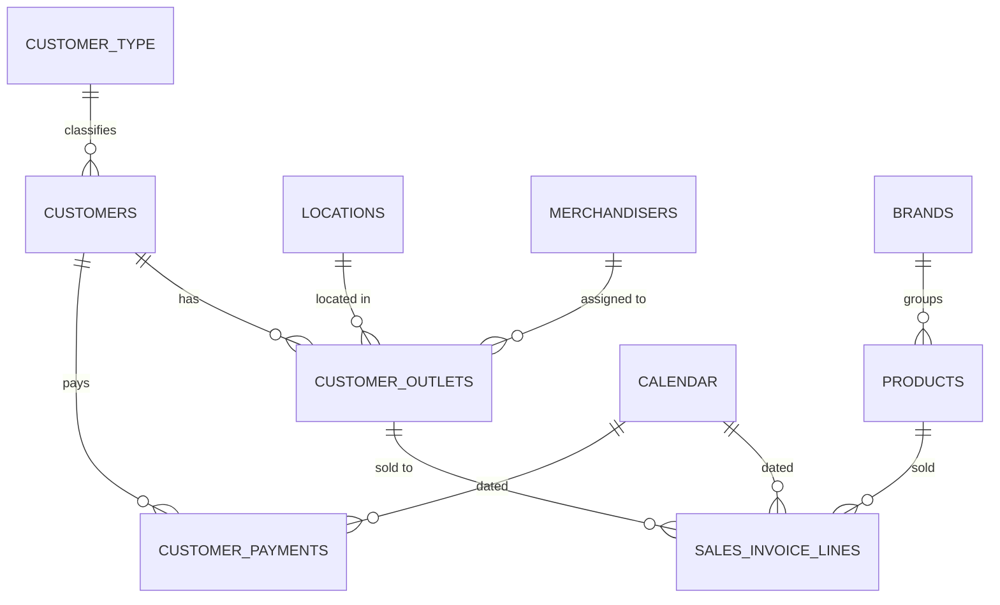

# Data Model

The semantic model follows a star schema: one core sales fact table plus a customer
payments fact, hung off shared customer, product, brand, calendar, and location
dimensions. Source data is imported from an on-premises ERP database via Power
Query; entity names (customers, stores, products) are generic sample labels — this
repository documents structure and logic, not real business data.

> **Scope note.** This repository covers the **Sales Metrics** module only — daily
> and monthly sales monitoring across time, brand/product, customer/store, and
> sales-rep dimensions. The full solution also includes separate modules for pricing
> & margin, trade marketing/bonus, sales planning, stock, and portfolio analytics,
> which are out of scope here.

## Entity-relationship diagram



## Table catalog

### Dimensions

| Table | Purpose |
|---|---|
| **Calendar** | Date dimension spanning last year through this year. Hidden hierarchy (Quarter → Month → Week → Date) plus working-day helper measures (days elapsed/remaining this year, current week/month) that back the [function library](dax-functions.md)'s period-window logic. |
| **Products** | Product/article master. |
| **Brands** | Brand master (10 brands across 4 divisions). Carries each brand's commercial growth target (plan index), used by the sales-planning measures referenced from this module's pages. |
| **Customers** | Customer master. Power Query derives **sales channel** (Modern Trade / Traditional Trade / E-commerce) and a **Key Account tier** from ERP classification codes, plus payment terms and account balance/currency. |
| **Customer Outlets** | Individual outlet/branch under each customer. Derives sales channel, merchandiser assignment, and regional sales-rep / area-manager codes from location + channel combinations. |
| **Customer Type** | Lookup restricting the sales fact to genuine sell-through customers (excludes internal/non-sales subject types). |
| **Locations** | City/location master, grouped into 4 named delivery routes/territories used on the Sales Representative page's map visual. |
| **Merchandisers** | Field merchandiser roster, linked from Customer Outlets. |

### Facts

| Table | Purpose |
|---|---|
| **Sales Invoice Lines** | **The core sales fact table.** One row per invoice line: quantity, list price, discount %, extra discount %, average cost, VAT, and a returns flag. Gross/net unit price and VAT-inclusive cost are computed in Power Query. Every measure in this module is built on this table. |
| **Customer Payments** | Customer ledger extract (debits/credits) — source for the "payments received" KPIs shown on the Month and Customer/Store pages. |

## Relationships

All relationships are single-direction, many-to-one, and active.

| From | To |
|---|---|
| Products[BrandId] | Brands[Id] |
| Sales Invoice Lines[ProductId] | Products[Id] |
| Sales Invoice Lines[OutletId] | Customer Outlets[Id] |
| Sales Invoice Lines[Date] | Calendar[Date] |
| Customer Outlets[CustomerId] | Customers[Id] |
| Customer Outlets[LocationId] | Locations[Id] |
| Customer Outlets[MerchandiserId] | Merchandisers[Id] |
| Customers[CustomerTypeId] | Customer Type[Id] |
| Customer Payments[CustomerId] | Customers[Id] |
| Customer Payments[Date] | Calendar[Date] |

## Calculation groups

Two calculation groups let any measure be sliced by a single field instead of
needing separate current/prior/index measures wired into every visual:

- **`Actual | Prior Year`** — toggles a measure between *Current Year* and *Prior
  Year*, built on the `YearToDate` / `PriorYear` functions from the
  [function library](dax-functions.md).
- **`Year Comparison`** — adds a third calculation item, *Index*, returning the YoY
  growth % directly via `GrowthIndex`.

## Row-level security & dynamic localization

A single access-control table maps each signed-in viewer to a **role** (which
restricts the customer outlets / brands they can see) and a **culture**. That
culture value flows into one `[User Culture]` measure, which every visible label in
the report — page titles, KPI captions, filter headers, navigation menu — reads from
through a ~200-measure label dictionary:

```dax
Page Title | Monthly Performance =
    SWITCH (
        [User Culture],
        "en-US", "Monthly Performance",
        "sq-AL", "Performanca Mujore",
        "Monthly Performance"          -- default
    )
```

The report ships with **English as the default culture** and **Albanian as a fully
supported secondary culture** — a genuinely dynamic runtime switch, not two
duplicated sets of pages. Assign a viewer's row a different `Culture` value and
every page, KPI card, and filter relabels instantly; adding a third language means
adding one more `SWITCH` branch per label, not rebuilding the report.
