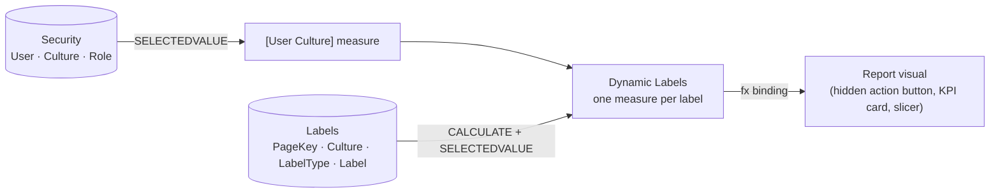

# Dynamic Titles & Localization

Every piece of user-facing text in this report — page titles, subtitles,
navigator tabs, KPI card headers, slicer captions — is a DAX measure lookup, not a
hardcoded string. This page is the full reference for that system: the three tables
behind it, the naming/key scheme, a worked example for every label family, and how a
label actually reaches the screen.

## Architecture



Three tables, three jobs:

| Table | Job |
|---|---|
| `Security` | Resolves *who* is looking and *which* culture they should see. |
| `Labels` | Holds *what* every label says, in every supported culture. Plain data — no DAX. |
| `Dynamic Labels` | Holds *the lookup* — one measure per label, each reading `Labels` filtered to its own key and the current culture. |

## The key scheme

`Labels[PageKey]` is a plain integer, but it's not arbitrary — it encodes both *which
page* and *which role* through numeric bands, so the whole label set for the report
sorts and scans predictably instead of needing a lookup table of its own:

| Band | Role | Formula |
|---|---|---|
| 1–7 | Page title | `PageKey = N` |
| 201–207 | Page subtitle | `PageKey = 200 + N` |
| 401–407 | Page navigator-tab label | `PageKey = 400 + N` |
| 1200s | Visual title | one `PageKey` per visual, allocated in build order |
| 1400s | Visual subtitle | one `PageKey` per visual, allocated in build order |

*N* is the page number in report order (see [Report Tour](report-pages.md)):

| N | Page |
|---|---|
| 1 | Monthly Performance |
| 2 | Time Frame |
| 3 | Brand / Product |
| 4 | Product Sales Analysis |
| 5 | Customer / Store |
| 6 | Store Performance |
| 7 | Sales Representative |

## `Labels` — representative rows

```
PageKey | PageName              | Culture | LabelType        | Label
--------|-----------------------|---------|-------------------|----------------------------------------
      1 | MonthlyPerformance    | en-US   | Title             | Monthly Performance
      1 | MonthlyPerformance    | sq-AL   | Title             | Performanca Mujore
    201 | MonthlyPerformance    | en-US   | Subtitle          | Daily and monthly sales pulse check
    201 | MonthlyPerformance    | sq-AL   | Subtitle          | Kontrolli ditor dhe mujor i shitjeve
    401 | MonthlyPerformance    | en-US   | Navigator Title   | Monthly Performance
    401 | MonthlyPerformance    | sq-AL   | Navigator Title   | Performanca Mujore
      7 | SalesRepresentative   | en-US   | Title             | Sales Representative
      7 | SalesRepresentative   | sq-AL   | Title             | Përfaqësuesi i Shitjes
   1201 | NetSalesCard          | en-US   | VisualTitle       | Net Sales Value
   1201 | NetSalesCard          | sq-AL   | VisualTitle       | Vlera e Shitjeve Neto
   1202 | GrossMarginCard       | en-US   | VisualTitle       | Gross Margin %
   1202 | GrossMarginCard       | sq-AL   | VisualTitle       | Marzha Bruto %
   1207 | DateSlicerMonthlyPerf | en-US   | VisualTitle       | Date Range
   1207 | DateSlicerMonthlyPerf | sq-AL   | VisualTitle       | Periudha e Datave
   1230 | TopClientsChart       | en-US   | VisualTitle       | Top Clients
   1230 | TopClientsChart       | sq-AL   | VisualTitle       | Klientët Kryesorë
   1402 | TopClientsChart       | en-US   | VisualSubtitle    | Ranked by YTD sales value
   1402 | TopClientsChart       | sq-AL   | VisualSubtitle    | Renditur sipas vlerës së shitjeve YTD
```

A Power Query guard on the `Labels` partition errors the refresh on a duplicate
`PageKey + Culture + LabelType` combination — a copy-pasted row that wasn't
re-keyed fails loudly at refresh time, not silently at render time.

## `Dynamic Labels` — the lookup pattern

Every measure in this table follows the same three-line shape: resolve the culture,
then `CALCULATE` a `SELECTEDVALUE` against `Labels` filtered to this label's exact
key and that culture.

```dax
'Page 1 | Title' =
    VAR _culture = [User Culture]
    RETURN
        CALCULATE (
            SELECTEDVALUE ( Labels[Label], "⚠" ),
            Labels[LabelType] = "Title",
            Labels[PageKey] = 1,
            Labels[Culture] = _culture
        )

'Page 1 | Subtitle' =
    VAR _culture = [User Culture]
    RETURN
        CALCULATE (
            SELECTEDVALUE ( Labels[Label], "⚠" ),
            Labels[LabelType] = "Subtitle",
            Labels[PageKey] = 201,
            Labels[Culture] = _culture
        )

'Page 7 | Navigator Title' =
    VAR _culture = [User Culture]
    RETURN
        CALCULATE (
            SELECTEDVALUE ( Labels[Label], "⚠" ),
            Labels[LabelType] = "Navigator Title",
            Labels[PageKey] = 407,
            Labels[Culture] = _culture
        )

'Net Sales Card | VisualTitle' =
    VAR _culture = [User Culture]
    RETURN
        CALCULATE (
            SELECTEDVALUE ( Labels[Label], "⚠" ),
            Labels[LabelType] = "VisualTitle",
            Labels[PageKey] = 1201,
            Labels[Culture] = _culture
        )
```

The `"⚠"` second argument to `SELECTEDVALUE` is the fallback when no row matches —
deliberately a visible warning glyph, not a quiet default to English. A missing
translation shows up as `⚠` on the page during review, instead of shipping a report
that silently reads wrong for one culture and looks fine for the other.

### The page-navigator exception

Each page's left-hand navigator tab needs its own label, but that label is *the same
text* as the page's own Navigator Title — so rather than adding a second `Labels` row
per page, `'PageNavN | Title'` re-reads the existing `400 + N` row directly:

```dax
'PageNav1 | Title' =
    VAR _culture = [User Culture]
    RETURN
        CALCULATE (
            SELECTEDVALUE ( Labels[Label], "⚠" ),
            Labels[LabelType] = "Navigator Title",
            Labels[PageKey] = 401,
            Labels[Culture] = _culture
        )
```

One `Labels` row, two consumers (`'Page 1 | Navigator Title'` and
`'PageNav1 | Title'`) — the nav bar and the in-page navigator section always agree
because they're reading the same source row, never two copies that can drift apart.

## Binding a label to a visual

A measure existing isn't what makes a title dynamic — the visual has to actually be
bound to it. Every page title in this report is a **hidden action-button visual**:
icon, outline, text, and fill are all set to `show: false`, and only the
`visualContainerObjects.title`/`subTitle` properties are shown, each bound via `fx`
to the matching measure:

```json
"title": [{
  "properties": {
    "show": { "expr": { "Literal": { "Value": "true" } } },
    "text": {
      "expr": {
        "Measure": {
          "Expression": { "SourceRef": { "Entity": "Dynamic Labels" } },
          "Property": "Page 1 | Title"
        }
      }
    }
  }
}]
```

Never a text box — a text box's content is a literal string with no `fx` option, so
a hardcoded title has no path back to `Labels` and quietly stops translating the
first time someone edits the page. KPI cards and slicer captions bind the same way,
through their own `VisualTitle`/`VisualSubtitle` measures.

## Adding a language

Because every label is a data row, not a code branch, supporting a third culture is
a data change, not a model change:

1. Add one `Security[Culture]` value for the pilot user(s).
2. Add one `Labels` row per existing label, in the new culture, same `PageKey` +
   `LabelType`.
3. Nothing in `Dynamic Labels` changes — every measure already filters on whatever
   `[User Culture]` resolves to.

No new measures, no new `SWITCH` branches, no touching the report canvas. The
`Labels` table is the entire surface area of a localization change.
